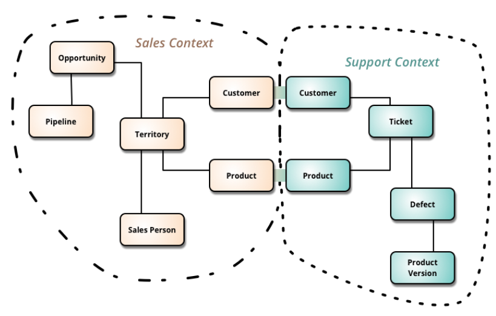

## Bounded Context
Bounded Context is a central pattern in Domain-Driven Design. 
It is the focus of DDD's strategic design section which is all about dealing with large models 
and teams. DDD deals with large models by dividing them into different Bounded Contexts 
and being explicit about their interrelationships.

As you try to model a larger domain, it gets progressively harder to build a single unified model. Different groups of people will use subtly different vocabularies in different parts of a large organization. The precision of modeling rapidly runs into this, often leading to a lot of confusion. Typically this confusion focuses on the central concepts of the domain. Early in my career I worked with a electricity utility - here the word "meter" meant subtly different things to different parts of the organization: was it the connection between the grid and a location, the grid and a customer, the physical meter itself (which could be replaced if faulty). These subtle polysemes could be smoothed over in conversation but not in the precise world of computers. Time and time again I see this confusion recur with polysemes like "Customer" and "Product".

In those younger days we were advised to build a unified model of the entire business, but DDD recognizes that we've learned that "total unification of the domain model for a large system will not be feasible or cost-effective" [1]. So instead DDD divides up a large system into Bounded Contexts, each of which can have a unified model - essentially a way of structuring MultipleCanonicalModels.

Bounded Contexts have both unrelated concepts (such as a support ticket only existing in a customer support context) but also share concepts (such as products and customers). Different contexts may have completely different models of common concepts with mechanisms to map between these polysemic concepts for integration. Several DDD patterns explore alternative relationships between contexts.

Various factors draw boundaries between contexts. Usually the dominant one is human culture, since models act as Ubiquitous Language, you need a different model when the language changes. You also find multiple contexts within the same domain context, such as the separation between in-memory and relational database models in a single application. This boundary is set by the different way we represent models.

## Aggregate

Aggregate is a pattern in Domain-Driven Design. A DDD aggregate is a cluster of domain objects
that can be treated as a single unit. An example may be an order and its line-items,
these will be separate objects, but it's useful to treat the order (together with its line items) 
as a single aggregate.

An aggregate will have one of its component objects be the aggregate root. 
Any references from outside the aggregate should only go to the aggregate root. 
The root can thus ensure the integrity of the aggregate as a whole.

Aggregates are the basic element of transfer of data storage - you request to load or save 
whole aggregates. Transactions should not cross aggregate boundaries.

DDD Aggregates are sometimes confused with collection classes (lists, maps, etc). 
DDD aggregates are domain concepts (order, clinic visit, playlist), 
while collections are generic. An aggregate will often contain mutliple collections, 
together with simple fields. The term "aggregate" is a common one, 
and is used in various different contexts (e.g. UML), in which case it does not refer
to the same concept as a DDD aggregate.
