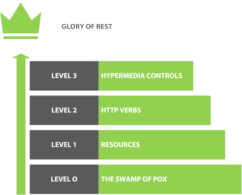

# REST API

## Response codes
1. Informational responses (**100–199**)
2. Successful responses (**200–299**)
3. Redirection messages (**300–399**)
4. Client error responses (**400–499**)
5. Server error responses (**500–599**)

## Methods

### GET
The GET method requests a representation of the specified resource. Requests using GET should only retrieve data.

### HEAD
The HEAD method asks for a response identical to a GET request, but without the response body.

### POST
The POST method submits an entity to the specified resource, often causing a change in state or side effects on the server.

### PUT
The PUT method replaces all current representations of the target resource with the request payload.

### DELETE
The DELETE method deletes the specified resource.

### CONNECT
The CONNECT method establishes a tunnel to the server identified by the target resource.

### OPTIONS
The OPTIONS method describes the communication options for the target resource.

### TRACE
The TRACE method performs a message loop-back test along the path to the target resource.

### PATCH
The PATCH method applies partial modifications to a resource.

### QUERY
The [QUERY(RFC)](https://www.ietf.org/id/draft-ietf-httpbis-safe-method-w-body-02.html) 
method provides a solution that spans the gap between the use of GET and POST.
As with POST, the input to the query operation is passed along within the payload of the request
rather than as part of the request URI. 
Unlike POST, however, the method is explicitly safe and idempotent, 
allowing functions like caching and automatic retries to operate.

## When to use PUT/PATCH/POST

1. PUT is meant to be used when you want to edit whole resource
2. PATCH is meant to be used when you edit only small part of the resource
3. POST - to create resource

## Levels of rest api maturity 

### Level 0 - The Swamp of POX
The Swamp of POX (Plain Old XML) means that you’re using HTTP. 
Technically, REST services can be provided over any application layer 
protocol as long as they conform to certain properties. 
In practice, basically, everyone uses HTTP.

Anyway - even Level 0, has some rules

1. Hyphens (-) should be used to improve the readability of URIs - Also referred to as spinal-case
2. Underscores (_) should not be used in URIs
3. Lowercase letters should be preferred in URI paths
4. File extensions should not be included in URIs

### Level 1 - Resources
API design at Level 1 is all about using different URLs 
to interact with the different resources in your application.

Rules at this level:
1. A trailing forward-slash (/) should not be included in URIs
- http://api.canvas.com/shape/  - BAD
- http://api.canvas.com/shape   - GOOD
2. Forward slash separator (/) must be used to indicate a hierarchical relationship
3. Should the endpoint name be singular or plural?

### Level 2 - Methods
See methods description above

### Level 2.1 - HTTP headers
**General Header** These header fields have general applicability for both request and response messages.

**Client Request Header** These header fields have applicability only for request messages.

**Server Response Header** These header fields have applicability only for response messages.

**Entity Header These** header fields define meta information about the entity-body or, if no BODY is present, about the resource identified by the request.

### Level 2.2 - Query Parameters
 - Paging
 - Filtering
 - Sorting
 - Searching

### Level 2.3 - Status Codes
See codes above

### Level 3 - Hypermedia Controls
This level is the one that everyone falls down on. 
There are two parts to this: content negotiation and HATEOAS. 
Content negotiation is focused on different representations of a particular resource, 
and HATEOAS is about the discoverability of actions on a resource

## API versioning
1. In URI `/v1` then `/v2` 
- hard to maintain
- introducing version identifiers in the URI leads to a very large URI footprint.
- old codebase to maintain
2. Negotiation by headers
 Example: `Content-Type: application/vnd.myname.v1+json`
 Have same issues as #1
3. Enter new elements in API (like new fields), let clients know that old fields are deprecated,
remove old fields after (whatever is you policy) period
4. **HATEOAS** constraint. According to this, most of the URIs should be DISCOVERED by Clients, not hardcoded. 
